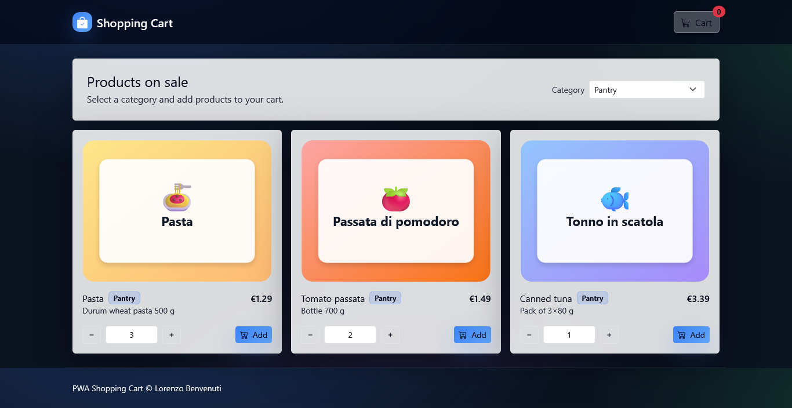
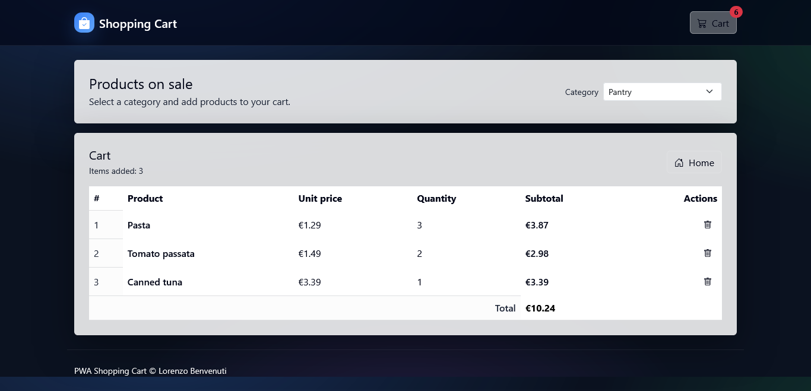
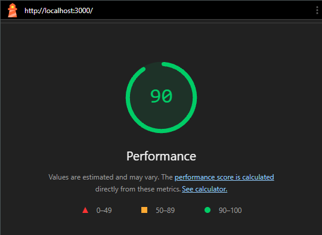

# Shopping Cart PWA


An **offline-first PWA** that loads a product catalog from JSON and lets you manage a **persistent shopping cart** via `localStorage`.
Designed as a portfolio project: **PWA + clean UX + CI + Playwright E2E tests**.

- **Repo:** `https://github.com/Lorenzo-Benvenuti/Shopping-Cart-PWA`

---

## Features
- Dynamic **product catalog** loaded from `public/data/products.json`
- **Category filter** (select)
- **Cart**: add/remove items, totals, live badge
- **Persistence**: cart stored in `localStorage` (`cart_v1`)
- **PWA**: manifest + service worker (cached assets + offline support)

---

## Tech stack
- Frontend: **HTML / CSS / Vanilla JS**
- UI: **Bootstrap 5 + Bootstrap Icons**
- Backend: **Node.js + Express** (static serving + SPA fallback)
- PWA: **Service Worker + Web App Manifest**
- Quality: **GitHub Actions CI**, **ESLint**, **Prettier**, **Playwright (E2E)**

---

## Getting started

### Requirements
- Node.js **>= 18**

### Install & run
```bash
npm ci
npm start
# http://localhost:3000
```

### Useful scripts
```bash
npm run lint          # node --check + eslint
npm run format        # prettier write
npm run format:check  # prettier check
npm test              # playwright e2e
```

> Note: ESLint/Prettier/Playwright are executed via `npx` to keep the lockfile minimal.

---

## Testing (E2E)
Playwright tests live in `tests/` and cover:
1. Product rendering + category filtering
2. Add to cart + **persistence after refresh**

Run:
```bash
npm test
```

---

## Offline / PWA

### How to test offline
1. Run the app locally
2. Chrome DevTools → **Application** → Service Workers (verify registration)
3. DevTools → **Network** → check **Offline**
4. Reload the page → the app should keep working (at least for the UI and cached assets)

---

## Project structure
```
server.js                 # Express static + SPA fallback
public/
  index.html              # UI shell
  js/app.js               # state + render + events
  data/products.json      # dataset
  service-worker.js       # offline cache
tests/
  e2e.spec.js             # Playwright E2E
.github/workflows/ci.yml  # CI
```

---

## Roadmap (from portfolio to product)
- [ ] Product search + sorting
- [ ] Better offline UX (richer connection state and cache status)
- [ ] Persist data on a backend (API + DB) instead of localStorage
- [ ] Lighthouse CI + performance budgets

---

## Screenshots

### Home


### Cart


### Lighthouse score


---

## License
MIT — see `LICENSE`.
